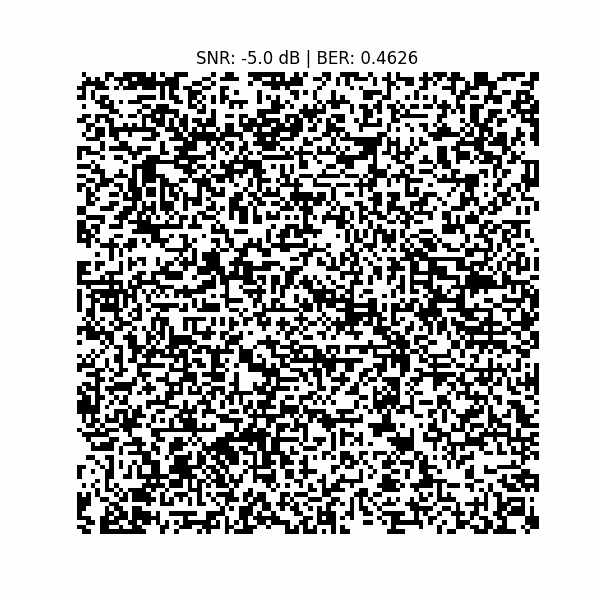
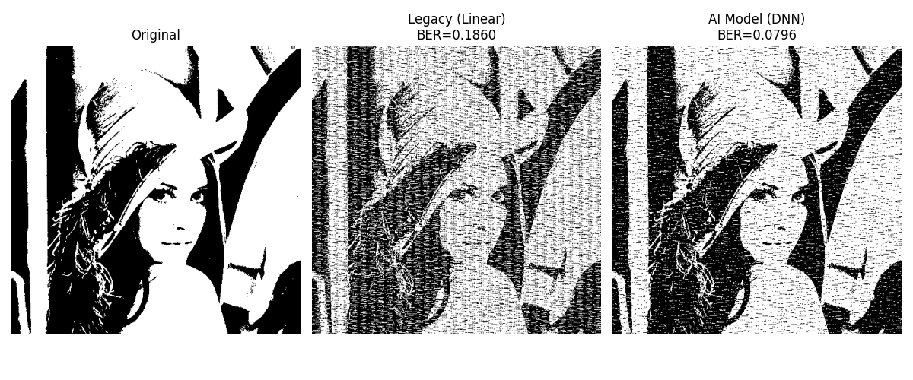
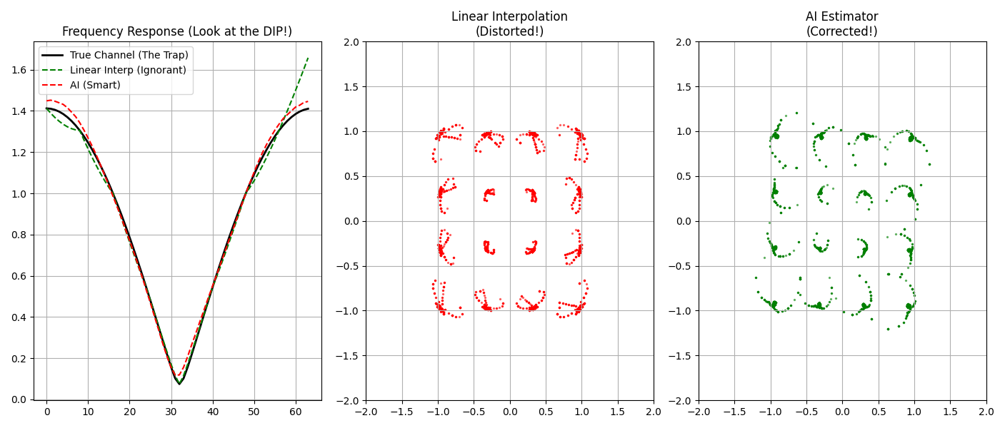

# 📡 PyOFDM: A Python-based OFDM Communication System



*(Above: Real-time visualization of image recovery as SNR increases from -5dB to 25dB)*

## 📖 Introduction
This project implements a full-chain **Orthogonal Frequency Division Multiplexing (OFDM)** communication system simulation in Python. It demonstrates how digital images are converted into waveforms, transmitted through a noisy multipath channel, and recovered at the receiver.

It is designed for students and researchers to understand the physical layer (PHY) of modern wireless standards like WiFi (802.11) and 5G NR.

## ✨ Key Features
- **Tx/Rx Chain**: Complete implementation of Mapping, IFFT/FFT, CP insertion/removal, and Equalization.
- **Modulation**: QPSK (Quadrature Phase Shift Keying).
- **Channel Model**:
  - Multipath Fading (ISI distortion).
  - AWGN (Additive White Gaussian Noise).
- **Visualization**: Real-time constellation diagrams and BER (Bit Error Rate) analysis.
- **Zero Dependencies**: Built purely on `numpy` and `scipy` (opencv only for image loading).

## 🛠️ Installation

1. Clone the repository:
   ```bash
   git clone https://github.com/ctegdf/OFDM_SDR_System.git

## 🧠 v2.0 Update: Deep Learning Powered Receiver

I have integrated a **Deep Neural Network (DNN)** to replace the traditional linear interpolation for channel estimation.

### AI vs Legacy Algorithm
The AI model successfully detects "Deep Fading" holes in the frequency domain that linear interpolation misses.


*(Result on 512x512 Lena image. **Legacy BER: 18.6% vs AI BER: 7.9%**. Note how the vertical stripes (deep fading errors) are removed by the AI.)*

### How to reproduce:
1. Generate training data: `python ai_training/generate_dataset.py`
2. Train the model: `python ai_training/train_model.py`
3. Run comparison: `python comparison_demo.py`

---
## 🌟 v3.0 Highlight: Conquering the "Deep Fading Trap"

We challenged the system with an extreme "Deep Fading" channel scenario (a near-zero energy notch located exactly between pilot carriers), which is a known trap for traditional linear interpolation.

### ⚔️ Visual Proof: AI vs. Legacy Linear Interpolation

Below is the direct comparison under 16-QAM modulation.



#### Analysis:
1.  **Frequency Response (Left Panel):**
    * **Black Line (Ground Truth):** Shows the actual channel with a severe dip.
    * **Green Line (Linear Interp):** completely misses the dip, interpolating straight over it (the "trap").
    * **Red Line (AI Model):** Successfully learns the non-linear structure and bends down into the dip, providing a much better estimation.
2.  **Constellation Diagrams (Middle & Right Panels):**
    * **Linear Interpolation (Middle):** Due to the wrong channel estimate, the 16-QAM points are severely twisted and distorted, leading to high bit error rates.
    * **AI Estimator (Right):** The constellation geometry is recovered, with points converging back to their correct grid positions.
---