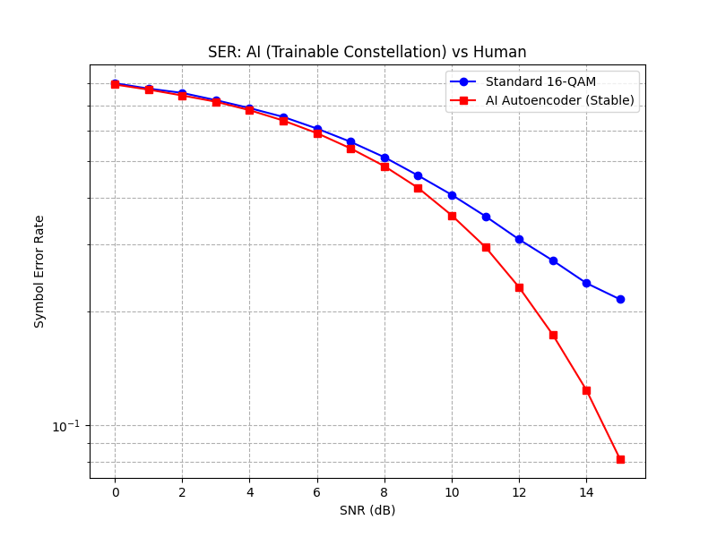

<div align="center">

# 📡 PyOFDM: 基于 Python 与 AI 的 OFDM 系统

[**English**](README.md) | [**中文文档**](README_CN.md)

</div>

---


*(上图：随着信噪比 (SNR) 从 -5dB 提升至 25dB，图像恢复过程的实时可视化)*

## 📖 简介
本项目实现了一个全链路的 **正交频分复用 (OFDM)** 通信系统 Python 仿真。它演示了数字图像如何转换为波形，通过充满噪声的多径信道传输，并在接收端恢复的过程。

本项目旨在帮助学生和研究人员理解现代无线标准（如 WiFi (802.11) 和 5G NR）的物理层 (PHY)。

## ✨ 核心特性
- **发射/接收链路**：完整实现了映射、IFFT/FFT、循环前缀 (CP) 插入/移除以及均衡。
- **调制方式**：QPSK (正交相移键控)。
- **信道模型**：
  - 多径衰落 (ISI 失真)。
  - AWGN (加性高斯白噪声)。
- **可视化**：实时星座图和误码率 (BER) 分析。
- **零依赖**：仅基于 `numpy` 和 `scipy` 构建（`opencv` 仅用于图像加载）。

## 🛠️ 安装

1. 克隆仓库：
   ```bash
   git clone [https://github.com/ctegdf/OFDM_SDR_System.git](https://github.com/ctegdf/OFDM_SDR_System.git)
   
## 🧠 v2.0 更新：深度学习驱动的接收机

我集成了一个 **深度神经网络 (DNN)** 来替代传统的线性插值进行信道估计。

### AI vs 传统算法
AI 模型成功检测到了传统线性插值所遗漏的频域“深衰落”空洞。


*(512x512 Lena 图的结果。**传统算法 BER: 18.6% vs AI BER: 7.9%**。注意 AI 如何消除了由深衰落错误导致的垂直条纹。)*

### 如何复现：
1. 生成训练数据：`python ai_training/generate_dataset.py`
2. 训练模型：`python ai_training/train_model.py`
3. 运行对比：`python run_comparison.py`

---
## 🌟 v3.0 亮点：征服“深衰落陷阱”

我们使用极端的“深衰落”信道场景（在导频载波之间存在一个接近零能量的凹陷）对系统进行了挑战，这对传统线性插值来说是一个已知的陷阱。

### ⚔️ 视觉证明：AI vs. 传统线性插值

下图是在 16-QAM 调制下的直接对比。


**新特性：**
1.  **支持 16-QAM**：升级系统核心以支持高阶调制 (16-QAM)。
2.  **深衰落陷阱测试**：创建了一个“陷阱信道”实验 (`run_trap_experiment.py`)，以可视化当线性插值在深衰落点失效时，AI 如何恢复信号。

**如何运行陷阱测试：**

    ```bash
    python run_trap_experiment.py

#### 分析：
1.  **频率响应（左图）：**
    * **黑线（真值）：** 显示了具有严重凹陷的实际信道。
    * **绿线（线性插值）：** 完全错过了凹陷，直接在上面插值过去（掉入“陷阱”）。
    * **红线（AI 模型）：** 成功学习到了非线性结构并向下弯曲进入凹陷，提供了更好的估计。
2.  **星座图（中图 & 右图）：**
    * **线性插值（中图）：** 由于错误的信道估计，16-QAM 点严重扭曲变形，导致高误码率。
    * **AI 估计器（右图）：** 星座图几何形状得到恢复，点收敛回正确的网格位置。
---

## 🏆 v4.0：端到端学习 vs. 硬件损伤

当标准 QAM 失效时，AI 能生存吗？
我们模拟了 **功率放大器 (PA) 削波** 场景（硬件非线性），这在节能型物联网设备中很常见。

- **标准 16-QAM**：在高信噪比下发生灾难性故障，因为角点被削波了。
- **AI 自编码器**：自动学习了一种 **“几何整形”**（星座点内缩）策略来避开削波区域。


*(结果：通过适应非线性信道约束，AI 在高信噪比下实现了显著更低的误符号率 (SER)。)*

### 🏃 如何运行 v4.0 实验：

1. 进入深度学习模块目录：
   ```bash
   cd deep_comm
2. 运行削波对抗基准测试：
    ```bash
    python benchmark_clipping.py
此脚本将自动训练 Autoencoder 模型，并在非线性削波信道下与标准 16-QAM 进行 SER (误符号率) 对比。